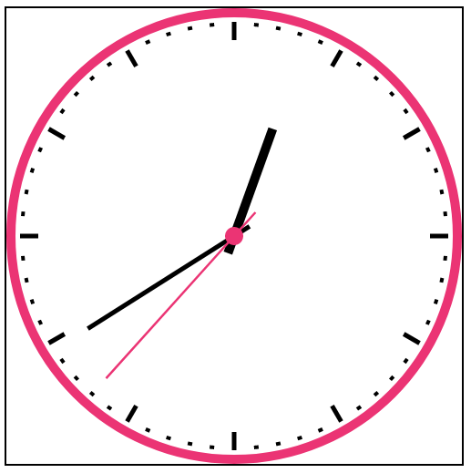

# Simple Analog Clock
It's made with simple HTML and javascript. You can very easily tweak it's appearance by manipulating the constants defined in the beginning of `canvas.js`.

Also feel free to use it inside your own project.

## Screenshots
